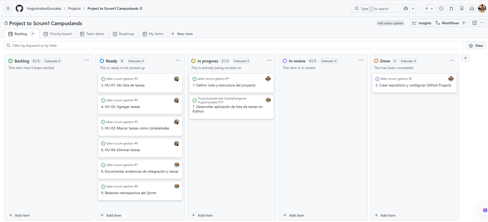
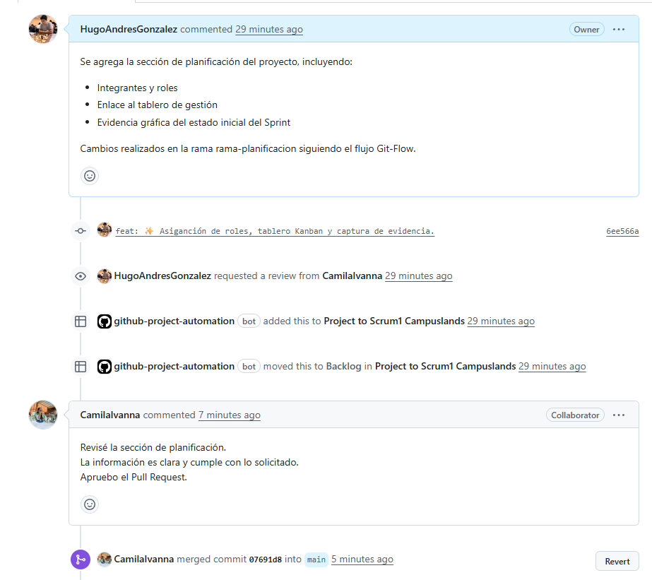
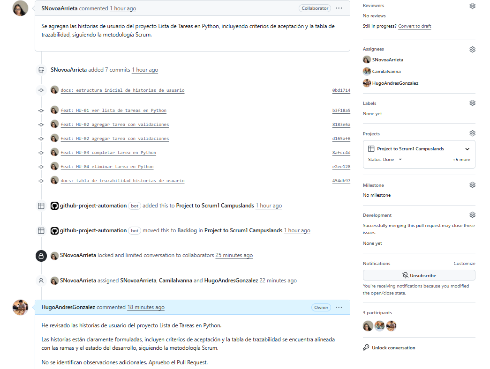

# Sección 1: 

### Integrantes y roles
- Hugo Andrés González Delgado – Scrum Master (Integrante A)
- Sofia Novoa Arrieta  – Product Owner (Integrante B)
- Camila Ivanna Dangond Tarazona – QA / Developer (Integrante C)

### Tablero de gestión
Enlace: https://github.com/users/HugoAndresGonzalez/projects/1/views/1?system_template=kanban

### Estado inicial del Sprint

# Sección 2: Historias de Usuario
Estas historias de usuario se desarrollan para una aplicación sencilla de Lista de Tareas implementada en Python.
# HU-01: Ver lista de tareas
**Como** usuario,  
**quiero** ver la lista de tareas registradas,  
**para** visualizar mis pendientes en cualquier momento.

**Criterios de aceptación**
- Dado que existen tareas, cuando solicito ver la lista, entonces se muestran todas.
- Dado que no existen tareas, el sistema muestra un mensaje informativo.

**Implementación**
- Función sugerida: `mostrar_tareas(tareas)`

# HU-02: Agregar tarea
**Como** usuario,  
**quiero** agregar una tarea escribiendo su descripción,  
**para** guardar nuevos pendientes.

**Criterios de aceptación**
- Se permite agregar tareas con texto válido.
- No se permiten tareas vacías.

**Implementación**
- Función sugerida: `agregar_tarea(tareas, descripcion)`
# HU-02: Agregar tarea
**Como** usuario,  
**quiero** agregar una tarea escribiendo su descripción,  
**para** guardar nuevos pendientes.

**Criterios de aceptación**
- Se permite agregar tareas con texto válido.
- No se permiten tareas vacías.

**Implementación**
- Función sugerida: `agregar_tarea(tareas, descripcion)`

# HU-03: Marcar tarea como completada
**Como** usuario,  
**quiero** marcar una tarea como completada,  
**para** identificar lo que ya terminé.

**Criterios de aceptación**
- Se puede cambiar el estado de una tarea existente.
- Si el ID no existe, el sistema muestra un error.

**Implementación**
- Función sugerida: `completar_tarea(tareas, id_tarea)`
# HU-04: Eliminar tarea
**Como** usuario,  
**quiero** eliminar una tarea existente,  
**para** mantener mi lista actualizada.

**Criterios de aceptación**
- Se elimina una tarea por ID válido.
- Si el ID no existe, no se realizan cambios.

**Implementación**
- Función sugerida: `eliminar_tarea(tareas, id_tarea)`

## Tabla de Trazabilidad

| ID Historia | Funcionalidad (Python) | Rama de Git | Estado |
|------------|--------------------------|-------------|--------|
| HU-01 | Mostrar tareas en consola | rama-historias | Finalizado |
| HU-02 | Agregar tareas con input | rama-historias | Finalizado |
| HU-03 | Completar tareas | rama-historias | Finalizado |
| HU-04 | Eliminar tareas | rama-historias | Finalizado |

# Sección 3: Evidencias y Retro

### ¿Qué fue lo más difícil de sincronizar?

Lo más difícil de sincronizar fue integrar los cambios realizados en la rama principal (`main`) con los avances hechos en paralelo por los demás integrantes del equipo. En varios momentos se presentaron conflictos porque se modificaron los mismos archivos y secciones de código o texto, lo que impidió que Git resolviera automáticamente la fusión.

---

### ¿Cómo resolvieron los conflictos de código/texto?

Los conflictos se resolvieron mediante un proceso manual y organizado. Primero, se identificaron los archivos en conflicto que Git señalaba durante el `merge` o `pull`. Luego, se revisaron cuidadosamente las diferencias entre versiones, comparando el código o el texto para decidir qué cambios conservar. En algunos casos se combinó información de ambas versiones para no perder aportes importantes. Finalmente, se verificó que todo funcionara correctamente y se confirmó la resolución con un commit, asegurando una correcta sincronización del proyecto.

### Evidencias PR

