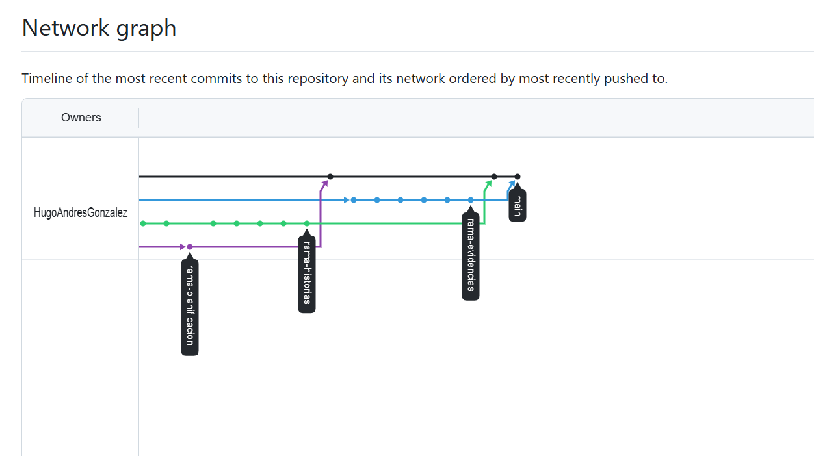

# Sección 1: Planificación
# Sección 2: Historias de Usuario
## Sección 3: Evidencias de Integración y Retrospectiva  
**Integrante C: Camila – QA / Developer**

### Evidencias de Integración

Durante el desarrollo del proyecto se evidenció el trabajo colaborativo mediante el uso de GitHub y la aplicación de la metodología Scrum. Cada integrante trabajó en su propia rama siguiendo el flujo Git-Flow, lo que permitió mantener la estabilidad de la rama principal y facilitar la integración de los cambios.

Como evidencia del proceso, se adjuntan capturas del historial **Network** del repositorio, donde se observa la creación de ramas independientes para planificación, historias de usuario y evidencias, así como su integración mediante Pull Requests revisados y aprobados por los compañeros del equipo.

Adicionalmente, se utilizó **GitHub Projects** como tablero Kanban para la gestión del Sprint, con las columnas *Backlog*, *Ready*, *In progress*, *In review* y *Done*. En este tablero se asignaron las tareas a cada integrante y se evidenció el avance progresivo desde la planificación hasta la finalización de las actividades.

Desde el rol de QA / Developer, se desarrolló una aplicación de **Lista de Tareas en Python (CLI)** como evidencia técnica del producto, implementando las historias de usuario definidas por el equipo y asegurando el correcto funcionamiento del flujo de la aplicación.

---

### Retrospectiva del Sprint

#### ¿Qué fue lo más difícil de sincronizar?
Lo más difícil de sincronizar fue la edición concurrente del archivo de documentación y la coordinación de los tiempos para realizar los commits y Pull Requests, debido a que los integrantes trabajaban de forma paralela sobre el mismo proyecto.

#### ¿Cómo resolvieron los conflictos de código o texto?
Los conflictos se resolvieron mediante la revisión de los Pull Requests, la comunicación previa entre los integrantes y la aplicación de buenas prácticas de control de versiones, como el uso de ramas independientes y commits claros antes de realizar el merge a la rama principal.

---

### Conclusión del Rol

El rol de QA / Developer permitió validar tanto el proceso técnico como la correcta aplicación de Scrum y GitHub, asegurando la trazabilidad entre tareas, commits y evidencias, y contribuyendo a la calidad final del proyecto.
